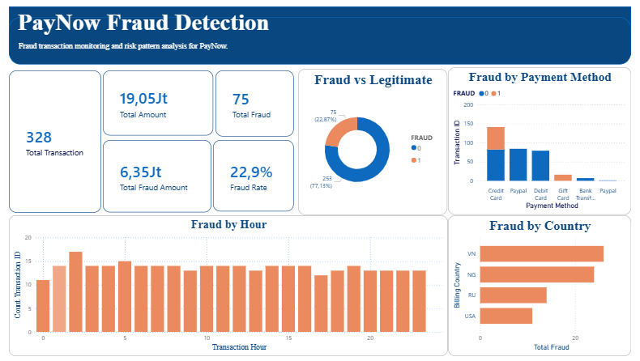

# PayNow Fraud Detection Dashboard

## Overview
This project analyzes fraudulent transaction patterns on the PayNow fintech platform using Power BI. The analysis aims to identify suspicious transaction behavior and provide insights to support early fraud detection strategies.


## Business Problem
PayNow experienced an increase in fraudulent transactions over the past few months. The Risk & Security team requires an initial investigative analysis to understand fraud patterns before implementing a machine learning-based fraud detection system.

## Objectives
- Identify characteristics of fraudulent transactions
- Analyze fraud patterns based on:
  - transaction amount
  - payment method
  - transaction time
  - billing country
- Support the development of business rules and fraud monitoring strategies

## Data Cleaning & Preparation
The following preprocessing steps were performed using Power Query and Python:

- Converted `transaction_time` into datetime format
- Extracted `transaction_hour`
- Standardized categorical values:
  - payment method
  - billing country
- Handled missing values
- Removed invalid negative transaction amounts
- Investigated transaction amount outliers


## Dashboard Features
The dashboard includes:

- Fraud transaction overview
- Fraud vs legitimate transaction comparison
- Fraud analysis by payment method
- Fraud analysis by country
- Fraud analysis by transaction hour
- KPI monitoring:
  - Total Transactions
  - Total Fraud
  - Fraud Rate
  - Fraud Amount


## Dashboard Preview




## Key Insights

### Fraud by Payment Method
Credit Card transactions show the highest number of fraudulent activities, indicating higher payment risk exposure.

### Fraud by Time
Fraudulent transactions appear across multiple hours and indicate temporal patterns during specific periods.

### Fraud by Country
Several countries show disproportionately higher fraud activity compared to transaction volume.

### Transaction Amount
Fraud occurs in both:
- low-value transactions (card testing)
- high-value transactions (high-impact fraud)

This indicates a multi-pattern fraud strategy.


## Business Recommendations
- Implement risk scoring based on transaction time and payment method
- Strengthen monitoring for high-risk countries
- Apply additional verification for suspicious transactions
- Develop multi-feature fraud detection instead of relying only on transaction amount

## Skills Demonstrated
- Data Cleaning
- Exploratory Data Analysis (EDA)
- Fraud Analytics
- Business Intelligence
- Dashboard Development
- Data Visualization
- DAX Measures
- Dashboard Validation


## Author
Amalia Tri Rahayu
```
